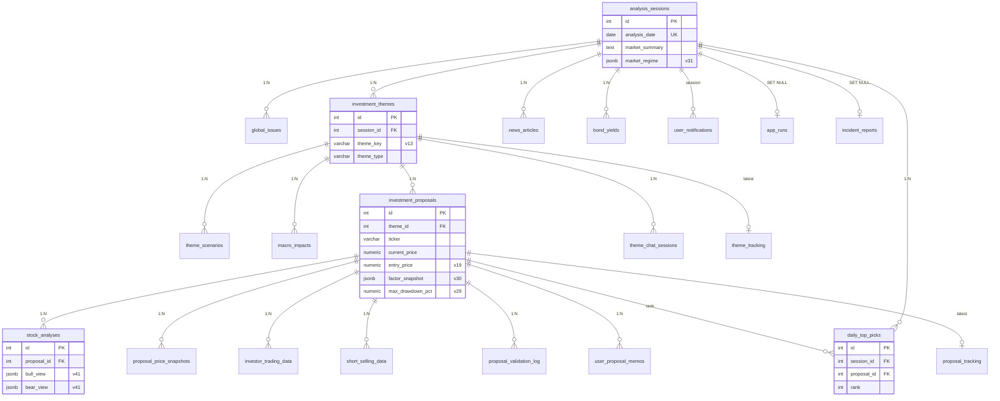
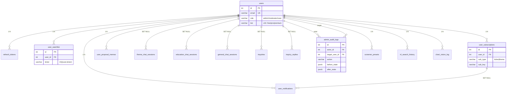
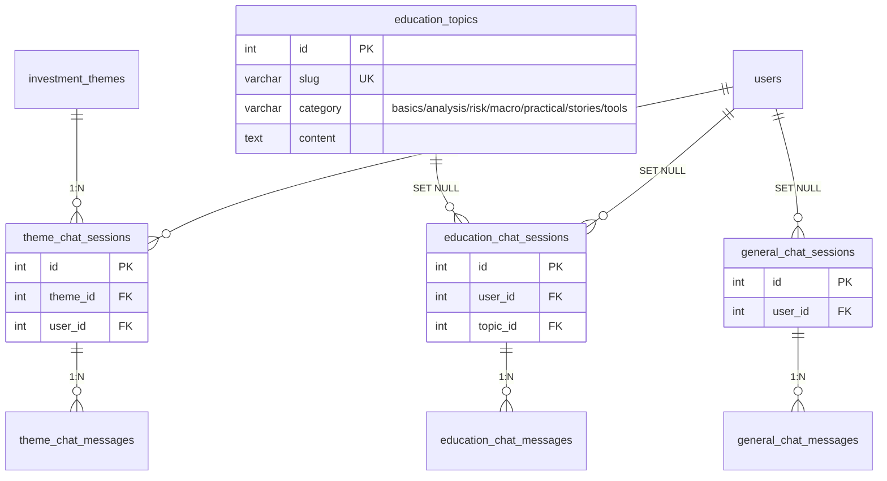

# DB 테이블 정의서 (v44 기준)

작성일: 2026-04-30 KST
스키마 버전: **v44** (`shared/db/schema.py:SCHEMA_VERSION`)
PostgreSQL 13+ / `init_db()` 실행 시 v1~v44 자동 마이그레이션

테이블 그룹 9개로 분류:
1. [메타](#0-메타) — `schema_version`
2. [분석 코어](#1-분석-코어) — sessions/issues/themes/proposals/scenarios/macro/stock_analyses + 추적
3. [Top Picks · 가격 추적](#2-top-picks--가격-추적) — daily_top_picks, proposal_price_snapshots
4. [KRX 확장](#3-krx-확장-데이터) — investor_trading_data, short_selling_data, bond_yields
5. [사용자 · 인증 · 개인화](#4-사용자--인증--개인화) — users, tokens, watchlist, subscriptions, notifications, memos, audit
6. [채팅](#5-채팅) — theme/education/general chat
7. [운영 · 진단 로깅](#6-운영--진단-로깅) — app_runs, app_logs, ai_query_archive, incident_reports
8. [유니버스 · 시장 데이터](#7-유니버스--시장-데이터-pit) — universe, ohlcv, fundamentals, factor, foreign_flow, indices, signals, krx_flow
9. [스크리너 · NL · Vision · 브리핑 · 뉴스 · 문의](#8-스크리너--nl--vision--브리핑--뉴스--문의)

각 표 컬럼 형식: `이름 / 타입 / NULL / 설명`. PK·FK·UNIQUE 는 비고에 표기.

---

## 0. 메타

### `schema_version`
v1 도입. 마이그레이션 진척도 추적.

| 컬럼 | 타입 | NULL | 설명 |
|---|---|---|---|
| version | INT | NO | PK |
| applied_at | TIMESTAMP | YES | 기본 NOW() |

---

## 1. 분석 코어

### `analysis_sessions`
하루 1세션 (UNIQUE). v1 도입, v2/v31 확장.

| 컬럼 | 타입 | NULL | 설명 |
|---|---|---|---|
| id | SERIAL | NO | PK |
| analysis_date | DATE | NO | UNIQUE — 같은 날짜 재실행 시 DELETE 후 재생성 |
| market_summary | TEXT | YES | |
| created_at | TIMESTAMP | YES | NOW() |
| risk_temperature | VARCHAR(10) | YES | v2 — 시장 리스크 온도 |
| data_sources | TEXT[] | YES | v2 — 사용된 RSS 소스 |
| market_regime | JSONB | YES | v31 — 진입 시점 시장 국면 스냅샷 (kospi/sp500/breadth_kr_pct) |

### `global_issues`
세션당 8~15개 이슈. v1/v2.

| 컬럼 | 타입 | NULL | 설명 |
|---|---|---|---|
| id | SERIAL | NO | PK |
| session_id | INT | YES | FK → analysis_sessions(id) ON DELETE CASCADE |
| category | VARCHAR(50) | YES | |
| region | VARCHAR(100) | YES | |
| title | VARCHAR(500) | YES | |
| summary | TEXT | YES | |
| source | VARCHAR(300) | YES | |
| importance | INT | YES | CHECK 1~5 |
| impact_short | TEXT | YES | v2 — 단기 영향 |
| impact_mid | TEXT | YES | v2 — 중기 영향 |
| impact_long | TEXT | YES | v2 — 장기 영향 |
| historical_analogue | TEXT | YES | v2 — 과거 유사 사례 |

### `investment_themes`
세션당 4~7개 테마. v1/v2/v13.

| 컬럼 | 타입 | NULL | 설명 |
|---|---|---|---|
| id | SERIAL | NO | PK |
| session_id | INT | YES | FK → analysis_sessions(id) ON DELETE CASCADE |
| theme_name | VARCHAR(200) | YES | |
| description | TEXT | YES | |
| related_issue_ids | INT[] | YES | global_issues.id 참조 (FK 미설정) |
| confidence_score | NUMERIC(3,2) | YES | 0.0~1.0 |
| time_horizon | VARCHAR(20) | YES | short/mid/long |
| key_indicators | TEXT[] | YES | |
| theme_type | VARCHAR(20) | YES | v2 — consensus/early/contrarian 등 |
| theme_validity | VARCHAR(20) | YES | v2 |
| theme_key | VARCHAR(200) | YES | v13 — AI 생성 영문 키 (히스토리 연결) |

### `investment_proposals`
테마당 10~15개 제안. v1/v2/v4/v5/v10/v14/v19/v20/v26/v29/v30.

| 컬럼 | 타입 | NULL | 설명 |
|---|---|---|---|
| id | SERIAL | NO | PK |
| theme_id | INT | YES | FK → investment_themes(id) ON DELETE CASCADE |
| asset_type | VARCHAR(50) | YES | stock/etf/bond/... |
| asset_name | VARCHAR(200) | YES | |
| ticker | VARCHAR(20) | YES | |
| market | VARCHAR(50) | YES | KOSPI/KOSDAQ/NASDAQ/NYSE/... |
| action | VARCHAR(10) | YES | buy/hold/sell |
| conviction | VARCHAR(10) | YES | high/mid/low |
| rationale | TEXT | YES | |
| risk_factors | TEXT | YES | |
| entry_condition | TEXT | YES | |
| exit_condition | TEXT | YES | |
| target_allocation | NUMERIC(5,2) | YES | % |
| current_price | NUMERIC(15,2) | YES | v2 — 실시간 시세 (실패 시 NULL) |
| target_price_low | NUMERIC(15,2) | YES | v2 — AI 추정 목표가 |
| target_price_high | NUMERIC(15,2) | YES | v2 |
| upside_pct | NUMERIC(7,2) | YES | v2 — DB 저장 시 재계산 |
| sentiment_score | NUMERIC(4,2) | YES | v2 |
| quant_score | NUMERIC(3,1) | YES | v2 |
| sector | VARCHAR(100) | YES | v2 |
| currency | VARCHAR(10) | YES | v2 |
| vendor_tier | INT | YES | v4 — 공급망 티어 |
| supply_chain_position | VARCHAR(200) | YES | v4 |
| discovery_type | VARCHAR(20) | YES | v5 — consensus/early_signal/contrarian/deep_value |
| price_momentum_check | VARCHAR(20) | YES | v5 — surge/normal/lagging |
| price_source | VARCHAR(20) | YES | v10 — ohlcv_db/yfinance_realtime/yfinance_close/pykrx/pykrx_crosscheck |
| return_1m_pct | NUMERIC(7,2) | YES | v14 — 추천 시점 기준 과거 모멘텀 |
| return_3m_pct | NUMERIC(7,2) | YES | v14 |
| return_6m_pct | NUMERIC(7,2) | YES | v14 |
| return_1y_pct | NUMERIC(7,2) | YES | v14 |
| entry_price | NUMERIC(15,2) | YES | v19 — 추천 시점 확정 기준가 |
| post_return_1m_pct | NUMERIC(7,2) | YES | v19 — 추천 후 1개월 실수익률 |
| post_return_3m_pct | NUMERIC(7,2) | YES | v19 |
| post_return_6m_pct | NUMERIC(7,2) | YES | v19 |
| post_return_1y_pct | NUMERIC(7,2) | YES | v19 |
| foreign_ownership_pct | NUMERIC(6,2) | YES | v20 |
| index_membership | TEXT[] | YES | v20 — KOSPI200/MSCI 등 |
| squeeze_risk | VARCHAR(10) | YES | v20 |
| foreign_net_buy_signal | VARCHAR(20) | YES | v20 |
| spec_snapshot | JSONB | YES | v26 — Stage 1-B1 스펙 audit |
| screener_match_reason | TEXT | YES | v26 |
| max_drawdown_pct | NUMERIC(7,2) | YES | v29 — entry 대비 최저점 낙폭 |
| max_drawdown_date | DATE | YES | v29 |
| alpha_vs_benchmark_pct | NUMERIC(7,2) | YES | v29 — 1y 알파 (B2 채움) |
| factor_snapshot | JSONB | YES | v30 — Stage 2 정량 팩터 raw + percentile |

인덱스: `idx_proposals_entry_price` (WHERE entry_price IS NOT NULL).

### `theme_scenarios`
테마당 Bull/Base/Bear 3시나리오. v2.

| 컬럼 | 타입 | NULL | 설명 |
|---|---|---|---|
| id | SERIAL | NO | PK |
| theme_id | INT | YES | FK → investment_themes(id) ON DELETE CASCADE |
| scenario_type | VARCHAR(20) | NO | bull/base/bear |
| probability | NUMERIC(5,2) | YES | % |
| description | TEXT | YES | |
| key_assumptions | TEXT | YES | |
| market_impact | TEXT | YES | |

### `macro_impacts`
테마당 매크로 변수별 영향. v2.

| 컬럼 | 타입 | NULL | 설명 |
|---|---|---|---|
| id | SERIAL | NO | PK |
| theme_id | INT | YES | FK → investment_themes(id) ON DELETE CASCADE |
| variable_name | VARCHAR(100) | NO | 금리/환율/유가/... |
| base_case | VARCHAR(200) | YES | |
| worse_case | VARCHAR(200) | YES | |
| better_case | VARCHAR(200) | YES | |
| unit | VARCHAR(20) | YES | |

### `stock_analyses`
Stage 2 종목 심층분석. v2/v41.

| 컬럼 | 타입 | NULL | 설명 |
|---|---|---|---|
| id | SERIAL | NO | PK |
| proposal_id | INT | YES | FK → investment_proposals(id) ON DELETE CASCADE |
| company_overview | TEXT | YES | |
| financial_summary | JSONB | YES | |
| dcf_fair_value | NUMERIC(15,2) | YES | |
| dcf_wacc | NUMERIC(5,2) | YES | |
| industry_position | TEXT | YES | |
| momentum_summary | TEXT | YES | |
| risk_summary | TEXT | YES | |
| bull_case | TEXT | YES | |
| bear_case | TEXT | YES | |
| factor_scores | JSONB | YES | |
| report_markdown | TEXT | YES | |
| bull_view | JSONB | YES | v41 — Red Team 강세 시각 |
| bear_view | JSONB | YES | v41 |
| synthesis_summary | TEXT | YES | v41 |
| red_team_enabled | BOOLEAN | YES | v41 — 기본 FALSE |

### `theme_tracking`
테마 연속성 추적 (독립 테이블, UPSERT). v3.

| 컬럼 | 타입 | NULL | 설명 |
|---|---|---|---|
| id | SERIAL | NO | PK |
| theme_key | VARCHAR(200) | NO | UNIQUE — 정규화 키 |
| theme_name | VARCHAR(200) | NO | |
| first_seen_date | DATE | NO | |
| last_seen_date | DATE | NO | |
| streak_days | INT | YES | 기본 1 |
| appearances | INT | YES | 기본 1 |
| latest_confidence | NUMERIC(3,2) | YES | |
| prev_confidence | NUMERIC(3,2) | YES | |
| latest_theme_id | INT | YES | FK → investment_themes(id) ON DELETE SET NULL |

### `proposal_tracking`
종목 추적 (UPSERT, ticker+theme_key UNIQUE). v3.

| 컬럼 | 타입 | NULL | 설명 |
|---|---|---|---|
| id | SERIAL | NO | PK |
| ticker | VARCHAR(20) | NO | |
| asset_name | VARCHAR(200) | YES | |
| theme_key | VARCHAR(200) | YES | UNIQUE(ticker, theme_key) |
| first_recommended_date | DATE | NO | |
| last_recommended_date | DATE | NO | |
| recommendation_count | INT | YES | 기본 1 |
| latest_action | VARCHAR(10) | YES | |
| prev_action | VARCHAR(10) | YES | |
| latest_conviction | VARCHAR(10) | YES | |
| latest_target_price_low | NUMERIC(15,2) | YES | |
| latest_target_price_high | NUMERIC(15,2) | YES | |
| prev_target_price_low | NUMERIC(15,2) | YES | |
| prev_target_price_high | NUMERIC(15,2) | YES | |
| latest_quant_score | NUMERIC(3,1) | YES | |
| latest_sentiment_score | NUMERIC(4,2) | YES | |
| latest_proposal_id | INT | YES | FK → investment_proposals(id) ON DELETE SET NULL |

---

## 2. Top Picks · 가격 추적

### `daily_top_picks`
세션별 일별 Top Picks 순위. v15.

| 컬럼 | 타입 | NULL | 설명 |
|---|---|---|---|
| id | SERIAL | NO | PK |
| session_id | INT | YES | FK → analysis_sessions(id) ON DELETE CASCADE |
| analysis_date | DATE | NO | UNIQUE(analysis_date, rank) |
| rank | INT | NO | |
| proposal_id | INT | YES | FK → investment_proposals(id) ON DELETE CASCADE |
| score_rule | NUMERIC(7,2) | YES | 룰 기반 |
| score_final | NUMERIC(7,2) | YES | AI 재정렬 후 |
| score_breakdown | JSONB | YES | |
| rationale_text | TEXT | YES | |
| key_risk | TEXT | YES | |
| source | VARCHAR(20) | YES | rule/ai_rerank |
| created_at | TIMESTAMP | YES | |

### `proposal_price_snapshots`
일별 종가 스냅샷 (post_return 계산 원본). v19.

| 컬럼 | 타입 | NULL | 설명 |
|---|---|---|---|
| id | SERIAL | NO | PK |
| proposal_id | INT | NO | FK → investment_proposals(id) ON DELETE CASCADE |
| snapshot_date | DATE | NO | UNIQUE(proposal_id, snapshot_date) |
| price | NUMERIC(15,2) | NO | |
| price_source | VARCHAR(30) | YES | |
| created_at | TIMESTAMP | YES | |

---

## 3. KRX 확장 데이터

### `investor_trading_data`
종목별 외국인/기관 수급 (제안 기준). v20.

| 컬럼 | 타입 | NULL | 설명 |
|---|---|---|---|
| id | SERIAL | NO | PK |
| proposal_id | INT | YES | FK → investment_proposals(id) ON DELETE CASCADE |
| snapshot_date | DATE | NO | UNIQUE(proposal_id, snapshot_date) |
| foreign_net_buy_5d | BIGINT | YES | |
| foreign_net_buy_20d | BIGINT | YES | |
| inst_net_buy_5d | BIGINT | YES | |
| inst_net_buy_20d | BIGINT | YES | |
| foreign_consecutive_days | INT | YES | 외국인 연속 순매수일 |
| daily_data | JSONB | YES | |
| created_at | TIMESTAMP | YES | |

### `short_selling_data`
공매도 현황. v20.

| 컬럼 | 타입 | NULL | 설명 |
|---|---|---|---|
| id | SERIAL | NO | PK |
| proposal_id | INT | YES | FK → investment_proposals(id) ON DELETE CASCADE |
| snapshot_date | DATE | NO | UNIQUE(proposal_id, snapshot_date) |
| short_balance_ratio_pct | NUMERIC(7,2) | YES | |
| short_volume_ratio_pct | NUMERIC(7,2) | YES | |
| short_balance_change_5d_pct | NUMERIC(7,2) | YES | |
| squeeze_risk | VARCHAR(10) | YES | low/mid/high |
| daily_data | JSONB | YES | |
| created_at | TIMESTAMP | YES | |

### `bond_yields`
세션별 국채 금리 스냅샷. v20.

| 컬럼 | 타입 | NULL | 설명 |
|---|---|---|---|
| id | SERIAL | NO | PK |
| session_id | INT | YES | FK → analysis_sessions(id) ON DELETE CASCADE |
| snapshot_date | DATE | NO | UNIQUE(session_id, snapshot_date) |
| kr_1y..kr_30y | NUMERIC(6,3) | YES | 만기별 |
| corp_aa | NUMERIC(6,3) | YES | |
| cd_91d | NUMERIC(6,3) | YES | |
| spread_10y_2y | NUMERIC(6,3) | YES | |
| yield_curve_status | VARCHAR(20) | YES | normal/flat/inverted |
| created_at | TIMESTAMP | YES | |

---

## 4. 사용자 · 인증 · 개인화

### `users`
회원. v11/v16.

| 컬럼 | 타입 | NULL | 설명 |
|---|---|---|---|
| id | SERIAL | NO | PK |
| email | VARCHAR(255) | NO | UNIQUE |
| password_hash | VARCHAR(255) | YES | bcrypt |
| nickname | VARCHAR(100) | NO | |
| role | VARCHAR(20) | NO | CHECK admin/moderator/user, 기본 user |
| is_active | BOOLEAN | NO | 기본 TRUE |
| created_at | TIMESTAMP | YES | |
| last_login_at | TIMESTAMP | YES | |
| oauth_provider | VARCHAR(50) | YES | |
| oauth_provider_id | VARCHAR(255) | YES | |
| tier | VARCHAR(20) | NO | v16 — CHECK free/pro/premium, 기본 free |
| tier_expires_at | TIMESTAMP | YES | v16 |

### `refresh_tokens`
JWT 리프레시 토큰. v11.

| 컬럼 | 타입 | NULL | 설명 |
|---|---|---|---|
| id | SERIAL | NO | PK |
| user_id | INT | NO | FK → users(id) ON DELETE CASCADE |
| token_hash | VARCHAR(255) | NO | UNIQUE |
| expires_at | TIMESTAMP | NO | |
| created_at | TIMESTAMP | YES | |
| revoked_at | TIMESTAMP | YES | |

### `user_watchlist`
관심 종목. v12.

| 컬럼 | 타입 | NULL | 설명 |
|---|---|---|---|
| id | SERIAL | NO | PK |
| user_id | INT | NO | FK → users(id) ON DELETE CASCADE |
| ticker | VARCHAR(20) | NO | UNIQUE(user_id, ticker) |
| asset_name | VARCHAR(200) | YES | |
| memo | TEXT | YES | |
| created_at | TIMESTAMP | YES | |

### `user_subscriptions`
테마/종목 알림 구독. v12.

| 컬럼 | 타입 | NULL | 설명 |
|---|---|---|---|
| id | SERIAL | NO | PK |
| user_id | INT | NO | FK → users(id) ON DELETE CASCADE |
| sub_type | VARCHAR(10) | NO | CHECK ticker/theme |
| sub_key | VARCHAR(200) | NO | UNIQUE(user_id, sub_type, sub_key) |
| label | VARCHAR(200) | YES | |
| created_at | TIMESTAMP | YES | |

### `user_notifications`
알림 이력 (분석 저장 시 자동 생성). v12.

| 컬럼 | 타입 | NULL | 설명 |
|---|---|---|---|
| id | SERIAL | NO | PK |
| user_id | INT | NO | FK → users(id) ON DELETE CASCADE |
| sub_id | INT | YES | FK → user_subscriptions(id) ON DELETE SET NULL |
| session_id | INT | YES | FK → analysis_sessions(id) ON DELETE CASCADE |
| title | VARCHAR(300) | NO | |
| detail | TEXT | YES | |
| link | VARCHAR(500) | YES | |
| is_read | BOOLEAN | YES | 기본 FALSE |
| created_at | TIMESTAMP | YES | |

부분 인덱스: `idx_user_notifications_unread WHERE is_read=FALSE`.

### `user_proposal_memos`
제안 메모. v12.

| 컬럼 | 타입 | NULL | 설명 |
|---|---|---|---|
| id | SERIAL | NO | PK |
| user_id | INT | NO | FK → users(id) ON DELETE CASCADE |
| proposal_id | INT | NO | FK → investment_proposals(id) ON DELETE CASCADE, UNIQUE(user_id, proposal_id) |
| content | TEXT | NO | |
| created_at | TIMESTAMP | YES | |
| updated_at | TIMESTAMP | YES | |

### `admin_audit_logs`
관리자 감사 로그. v17. 이메일 denormalize.

| 컬럼 | 타입 | NULL | 설명 |
|---|---|---|---|
| id | SERIAL | NO | PK |
| actor_id | INT | YES | FK → users(id) ON DELETE SET NULL |
| actor_email | VARCHAR(255) | YES | |
| target_user_id | INT | YES | FK → users(id) ON DELETE SET NULL |
| target_email | VARCHAR(255) | YES | |
| action | VARCHAR(40) | NO | tier_change/role_change/status_change/password_reset/user_delete/systemd_* |
| before_state | JSONB | YES | |
| after_state | JSONB | YES | |
| reason | TEXT | YES | |
| created_at | TIMESTAMP | YES | |

---

## 5. 채팅

### `theme_chat_sessions` / `theme_chat_messages`
테마 기반 채팅. v6/v11.

`theme_chat_sessions`:
| 컬럼 | 타입 | NULL | 설명 |
|---|---|---|---|
| id | SERIAL | NO | PK |
| theme_id | INT | YES | FK → investment_themes(id) ON DELETE CASCADE |
| title | VARCHAR(500) | YES | |
| created_at | TIMESTAMP | YES | |
| updated_at | TIMESTAMP | YES | |
| user_id | INT | YES | v11 — FK → users(id) ON DELETE SET NULL |

`theme_chat_messages`:
| 컬럼 | 타입 | NULL | 설명 |
|---|---|---|---|
| id | SERIAL | NO | PK |
| chat_session_id | INT | YES | FK → theme_chat_sessions(id) ON DELETE CASCADE |
| role | VARCHAR(10) | NO | CHECK user/assistant |
| content | TEXT | NO | |
| created_at | TIMESTAMP | YES | |

### `education_topics`
교육 커리큘럼. v21/v24/v35/v36/v37/v38.

| 컬럼 | 타입 | NULL | 설명 |
|---|---|---|---|
| id | SERIAL | NO | PK |
| category | VARCHAR(50) | NO | basics/analysis/risk/macro/practical/stories/tools |
| slug | VARCHAR(100) | NO | UNIQUE |
| title | VARCHAR(200) | NO | |
| summary | TEXT | YES | |
| content | TEXT | NO | markdown (SVG 시각화 포함) |
| examples | JSONB | YES | 기본 [] |
| difficulty | VARCHAR(20) | YES | beginner/intermediate/advanced |
| sort_order | INT | YES | |
| created_at | TIMESTAMP | YES | |

### `education_chat_sessions` / `education_chat_messages`
AI 튜터 채팅. v21.

`education_chat_sessions`:
| 컬럼 | 타입 | NULL | 설명 |
|---|---|---|---|
| id | SERIAL | NO | PK |
| user_id | INT | YES | FK → users(id) ON DELETE SET NULL |
| topic_id | INT | YES | FK → education_topics(id) ON DELETE SET NULL |
| title | VARCHAR(200) | YES | |
| created_at / updated_at | TIMESTAMP | YES | |

`education_chat_messages`:
| 컬럼 | 타입 | NULL | 설명 |
|---|---|---|---|
| id | SERIAL | NO | PK |
| chat_session_id | INT | YES | FK → education_chat_sessions(id) ON DELETE CASCADE |
| role | VARCHAR(10) | NO | |
| content | TEXT | NO | |
| created_at | TIMESTAMP | YES | |

### `general_chat_sessions` / `general_chat_messages`
자유 질문 채팅 (Ask AI). v42. 테마/토픽 비종속.

`general_chat_sessions`:
| 컬럼 | 타입 | NULL | 설명 |
|---|---|---|---|
| id | SERIAL | NO | PK |
| user_id | INT | YES | FK → users(id) ON DELETE SET NULL |
| title | VARCHAR(500) | YES | |
| created_at / updated_at | TIMESTAMP | YES | |

`general_chat_messages`:
| 컬럼 | 타입 | NULL | 설명 |
|---|---|---|---|
| id | SERIAL | NO | PK |
| chat_session_id | INT | YES | FK → general_chat_sessions(id) ON DELETE CASCADE |
| role | VARCHAR(10) | NO | CHECK user/assistant |
| content | TEXT | NO | |
| created_at | TIMESTAMP | YES | |

---

## 6. 운영 · 진단 로깅

### `app_runs`
범용 실행 이력 (analyzer/api/관리 작업). v18.

| 컬럼 | 타입 | NULL | 설명 |
|---|---|---|---|
| id | SERIAL | NO | PK |
| run_type | VARCHAR(50) | NO | analyzer/briefing/universe_sync/... |
| status | VARCHAR(20) | NO | running/success/failed (기본 running) |
| started_at | TIMESTAMP | YES | |
| finished_at | TIMESTAMP | YES | |
| duration_sec | NUMERIC(10,2) | YES | |
| summary | TEXT | YES | |
| error_message | TEXT | YES | |
| meta | JSONB | YES | |
| session_id | INT | YES | FK → analysis_sessions(id) ON DELETE SET NULL |

### `app_logs`
실행별 상세 로그. v18/v23.

| 컬럼 | 타입 | NULL | 설명 |
|---|---|---|---|
| id | SERIAL | NO | PK |
| run_id | INT | YES | FK → app_runs(id) ON DELETE CASCADE |
| level | VARCHAR(10) | NO | DEBUG/INFO/WARN/ERROR |
| source | VARCHAR(100) | YES | 모듈명 |
| message | TEXT | NO | |
| detail | TEXT | YES | |
| created_at | TIMESTAMP | YES | |
| context | JSONB | YES | v23 — stage/ticker/theme_key 구조화 |

부분 인덱스: `idx_app_logs_context_ticker ON app_logs((context->>'ticker')) WHERE context ? 'ticker'`.

### `ai_query_archive`
Claude SDK 쿼리 원본 영구 보존. v23.

| 컬럼 | 타입 | NULL | 설명 |
|---|---|---|---|
| id | SERIAL | NO | PK |
| run_id | INT | YES | FK → app_runs(id) ON DELETE CASCADE |
| stage | VARCHAR(50) | YES | stage1/stage2/translate/... |
| target_key | VARCHAR(200) | YES | theme_key/ticker |
| model | VARCHAR(80) | YES | |
| prompt_system | TEXT | YES | |
| prompt_user | TEXT | YES | |
| response_raw | TEXT | YES | |
| response_chars | INT | YES | |
| elapsed_sec | NUMERIC(8,2) | YES | |
| parse_status | VARCHAR(30) | YES | success/sanitized_recovered/truncated_recovered/timeout_partial/failed/empty |
| parse_error | TEXT | YES | |
| recovered_fields | JSONB | YES | |
| created_at | TIMESTAMP | YES | |

### `incident_reports`
실행별 사건 요약. v23.

| 컬럼 | 타입 | NULL | 설명 |
|---|---|---|---|
| id | SERIAL | NO | PK |
| run_id | INT | YES | UNIQUE FK → app_runs(id) ON DELETE CASCADE |
| session_id | INT | YES | FK → analysis_sessions(id) ON DELETE SET NULL |
| severity | VARCHAR(20) | YES | info/warning/critical |
| issue_count | INT | YES | |
| report | JSONB | NO | |
| created_at | TIMESTAMP | YES | |

---

## 7. 유니버스 · 시장 데이터 (PIT)

`stock_universe`는 종목 마스터 1 row, 시계열 테이블들은 **FK 미설정** (PIT 원칙 — 상폐 종목 이력 보존).

### `stock_universe`
검증된 종목 화이트리스트. v25.

| 컬럼 | 타입 | NULL | 설명 |
|---|---|---|---|
| id | SERIAL | NO | PK |
| ticker | TEXT | NO | UNIQUE(ticker, market) |
| market | TEXT | NO | KOSPI/KOSDAQ/NASDAQ/NYSE |
| asset_name | TEXT | NO | |
| asset_name_en | TEXT | YES | |
| sector_gics | TEXT | YES | |
| sector_krx | TEXT | YES | |
| sector_norm | TEXT | YES | 28버킷 정규화 |
| industry | TEXT | YES | |
| market_cap_krw | BIGINT | YES | |
| market_cap_bucket | TEXT | YES | mega/large/mid/small |
| last_price | NUMERIC(18,4) | YES | |
| last_price_ccy | TEXT | YES | KRW/USD |
| last_price_at | TIMESTAMPTZ | YES | |
| listed | BOOLEAN | YES | 기본 TRUE |
| delisted_at | DATE | YES | |
| has_preferred | BOOLEAN | YES | |
| aliases | JSONB | YES | |
| data_source | TEXT | YES | |
| meta_synced_at | TIMESTAMPTZ | YES | |
| price_synced_at | TIMESTAMPTZ | YES | |
| created_at | TIMESTAMPTZ | YES | |

### `stock_universe_ohlcv`
종목별 일별 OHLCV. v27/v28. PK `(ticker, market, trade_date)`.

| 컬럼 | 타입 | NULL | 설명 |
|---|---|---|---|
| ticker | TEXT | NO | PK |
| market | TEXT | NO | PK |
| trade_date | DATE | NO | PK |
| open / high / low | NUMERIC(18,4) | YES | |
| close | NUMERIC(18,4) | NO | |
| volume | BIGINT | YES | |
| change_pct | NUMERIC(10,4) | YES | v28 — 정수부 6자리로 확장 |
| data_source | TEXT | NO | pykrx/yfinance |
| adjusted | BOOLEAN | YES | 기본 FALSE |
| created_at | TIMESTAMPTZ | YES | |

### `stock_universe_fundamentals`
종목별 PIT 펀더 (PER/PBR/EPS/BPS/DPS/배당률). v39. PK `(ticker, market, snapshot_date)`.

| 컬럼 | 타입 | NULL | 설명 |
|---|---|---|---|
| ticker / market / snapshot_date | | NO | PK |
| per | NUMERIC(12,4) | YES | |
| pbr | NUMERIC(12,4) | YES | |
| eps | NUMERIC(18,4) | YES | |
| bps | NUMERIC(18,4) | YES | |
| dps | NUMERIC(18,4) | YES | |
| dividend_yield | NUMERIC(8,4) | YES | |
| data_source | TEXT | NO | pykrx/yfinance_info |
| fetched_at | TIMESTAMPTZ | YES | |

### `stock_universe_factor_snapshot`
정량 팩터 universe-wide percentile. v41. PK `(ticker, market, snapshot_date)`.

| 컬럼 | 타입 | NULL | 설명 |
|---|---|---|---|
| ticker / market / snapshot_date | | NO | PK |
| r1m_pctile / r3m_pctile / r6m_pctile / r1y_pctile | NUMERIC(5,4) | YES | 0~1 |
| vol60_pctile | NUMERIC(5,4) | YES | |

### `stock_universe_foreign_flow`
KRX 종목 외국인/기관/개인 수급 PIT. v44. PK `(ticker, market, snapshot_date)`. **KRX 한정**.

| 컬럼 | 타입 | NULL | 설명 |
|---|---|---|---|
| ticker / market / snapshot_date | | NO | PK |
| foreign_ownership_pct | NUMERIC(7,4) | YES | T+2 결제 룰로 snapshot_date-2영업일 기준 |
| foreign_net_buy_value | BIGINT | YES | KRW |
| inst_net_buy_value | BIGINT | YES | |
| retail_net_buy_value | BIGINT | YES | |
| data_source | TEXT | NO | 기본 pykrx |
| fetched_at | TIMESTAMPTZ | YES | |

### `market_indices_ohlcv`
벤치마크 지수 일별 OHLCV. v31. PK `(index_code, trade_date)`.

| 컬럼 | 타입 | NULL | 설명 |
|---|---|---|---|
| index_code | TEXT | NO | PK — KOSPI/KOSDAQ/SP500/NDX100 |
| trade_date | DATE | NO | PK |
| open/high/low | NUMERIC(18,4) | YES | |
| close | NUMERIC(18,4) | NO | |
| volume | BIGINT | YES | |
| change_pct | NUMERIC(10,4) | YES | |
| data_source | TEXT | NO | |
| created_at | TIMESTAMPTZ | YES | |

### `market_signals`
일별 이상 시그널 탐지. v32. UNIQUE `(signal_date, signal_type, ticker, market)`.

| 컬럼 | 타입 | NULL | 설명 |
|---|---|---|---|
| id | SERIAL | NO | PK |
| signal_date | DATE | NO | |
| signal_type | TEXT | NO | new_52w_high/low, volume_surge, above/below_200ma_cross, gap_up/down |
| ticker | TEXT | NO | |
| market | TEXT | NO | |
| metric | JSONB | YES | |
| created_at | TIMESTAMPTZ | YES | |

### `krx_investor_flow_daily`
KRX 일별 외국인·기관 수급 사전 집계 (auto_foreign_streak 시드용). v41. PK `(ticker, trade_date)`.

| 컬럼 | 타입 | NULL | 설명 |
|---|---|---|---|
| ticker | VARCHAR(16) | NO | PK |
| trade_date | DATE | NO | PK |
| foreign_net | BIGINT | YES | |
| inst_net | BIGINT | YES | |
| foreign_streak | INT | YES | 외국인 연속 순매수일 |

---

## 8. 스크리너 · NL · Vision · 브리핑 · 뉴스 · 문의

### `screener_presets`
스크리너 프리셋 (사용자 + 거장 시드). v33/v40/v41/v43.

| 컬럼 | 타입 | NULL | 설명 |
|---|---|---|---|
| id | SERIAL | NO | PK |
| user_id | INT | YES | v40 — 시드는 NULL, 사용자 프리셋은 FK → users(id) ON DELETE CASCADE |
| name | VARCHAR(200) | NO | UNIQUE(user_id, name) |
| description | TEXT | YES | |
| spec | JSONB | NO | UI 포맷 (max_per/max_pbr/return_ranges/...) |
| is_public | BOOLEAN | YES | 기본 FALSE |
| created_at / updated_at | TIMESTAMP | YES | |
| is_seed | BOOLEAN | YES | v40 — 거장/운영 시드 여부 |
| strategy_key | TEXT | YES | v40 — 부분 UNIQUE WHERE is_seed=TRUE |
| persona | TEXT | YES | v40 |
| persona_summary | TEXT | YES | v40 |
| markets_supported | TEXT[] | YES | v40 |
| risk_warning | TEXT | YES | v40 |

### `nl_search_history`
NL→SQL 검색 이력 + rate-limit. v41.

| 컬럼 | 타입 | NULL | 설명 |
|---|---|---|---|
| id | BIGSERIAL | NO | PK |
| user_id | INT | YES | FK → users(id) ON DELETE CASCADE |
| query_text | TEXT | NO | |
| generated_sql | TEXT | YES | |
| result_count | INT | YES | |
| status | TEXT | NO | CHECK ok/rejected/timeout/error |
| reject_reason | TEXT | YES | |
| duration_ms | INT | YES | |
| created_at | TIMESTAMPTZ | YES | |

### `chart_vision_log`
차트 Vision 응답 로그 (이미지 미저장). v41.

| 컬럼 | 타입 | NULL | 설명 |
|---|---|---|---|
| id | BIGSERIAL | NO | PK |
| user_id | INT | YES | FK → users(id) ON DELETE CASCADE |
| anonymous_token | CHAR(64) | YES | CHECK (user_id IS NOT NULL OR anonymous_token IS NOT NULL) |
| image_hash | CHAR(64) | NO | |
| ticker | VARCHAR(16) | YES | |
| response_text | TEXT | YES | |
| duration_ms | INT | YES | |
| created_at | TIMESTAMPTZ | YES | |

### `pre_market_briefings`
프리마켓 브리핑 영속화. v34. PK `briefing_date`.

| 컬럼 | 타입 | NULL | 설명 |
|---|---|---|---|
| briefing_date | DATE | NO | PK |
| source_trade_date | DATE | YES | 미국 OHLCV 거래일 (KST/EST 시차) |
| status | VARCHAR(20) | NO | success/partial/skipped/failed |
| us_summary | JSONB | YES | top_movers/sector_aggregates/indices |
| briefing_data | JSONB | YES | LLM 출력 (groups/kr_impact/morning_brief) |
| regime_snapshot | JSONB | YES | regime.compute_regime() 결과 |
| error_message | TEXT | YES | |
| generated_at / updated_at | TIMESTAMPTZ | YES | |

### `news_articles`
세션별 RSS 뉴스. v7/v8/v9/v41.

| 컬럼 | 타입 | NULL | 설명 |
|---|---|---|---|
| id | SERIAL | NO | PK |
| session_id | INT | YES | FK → analysis_sessions(id) ON DELETE CASCADE |
| category | VARCHAR(50) | NO | |
| source | VARCHAR(200) | YES | |
| title | VARCHAR(500) | NO | |
| summary | TEXT | YES | |
| link | VARCHAR(1000) | YES | |
| published | VARCHAR(100) | YES | |
| created_at | TIMESTAMP | YES | |
| title_ko | VARCHAR(500) | YES | v8 — 한글 번역 |
| summary_ko | TEXT | YES | v9 |
| lang | VARCHAR(8) | YES | v41 — 기본 ko |
| title_original | TEXT | YES | v41 — 원문 |
| region | VARCHAR(16) | YES | v41 — KR/US/GLOBAL |

### `inquiries` / `inquiry_replies`
고객 문의 게시판. v22.

`inquiries`:
| 컬럼 | 타입 | NULL | 설명 |
|---|---|---|---|
| id | SERIAL | NO | PK |
| user_id | INT | YES | FK → users(id) ON DELETE SET NULL |
| user_email | VARCHAR(200) | YES | denormalize |
| category | VARCHAR(30) | NO | general/bug/feature, 기본 general |
| title | VARCHAR(300) | NO | |
| content | TEXT | NO | |
| is_private | BOOLEAN | NO | 기본 FALSE |
| status | VARCHAR(20) | NO | open/answered/closed, 기본 open |
| created_at / updated_at | TIMESTAMP | YES | |

`inquiry_replies`:
| 컬럼 | 타입 | NULL | 설명 |
|---|---|---|---|
| id | SERIAL | NO | PK |
| inquiry_id | INT | NO | FK → inquiries(id) ON DELETE CASCADE |
| user_id | INT | YES | FK → users(id) ON DELETE SET NULL |
| user_email | VARCHAR(200) | YES | |
| role | VARCHAR(20) | NO | user/admin/moderator (기본 user) |
| content | TEXT | NO | |
| created_at | TIMESTAMP | YES | |

### `proposal_validation_log`
AI 제시 vs 실측 cross-check. v26.

| 컬럼 | 타입 | NULL | 설명 |
|---|---|---|---|
| id | SERIAL | NO | PK |
| proposal_id | INT | YES | FK → investment_proposals(id) ON DELETE CASCADE |
| field_name | TEXT | NO | current_price/per/... |
| ai_value | TEXT | YES | |
| actual_value | TEXT | YES | |
| evidence_source | TEXT | YES | |
| mismatch | BOOLEAN | YES | 기본 FALSE |
| mismatch_pct | NUMERIC(10,4) | YES | |
| checked_at | TIMESTAMPTZ | YES | |

---

## 관계 다이어그램 (Mermaid)

테이블 49개 전체를 한 ER 다이어그램에 넣으면 가독성이 죽으므로 4개 영역으로 분할.

### A. 분석 코어 + Top Picks + KRX 확장

### B. 사용자 · 인증 · 개인화 · 감사

### C. 채팅 영역

### D. 유니버스 · 시장 데이터 · 운영 로깅

```mermaid
erDiagram
    %% 유니버스는 PIT 원칙으로 시계열 테이블과 FK 미설정 (논리적 관계만)
    stock_universe }o..o{ stock_universe_ohlcv : "(ticker,market) 논리"
    stock_universe }o..o{ stock_universe_fundamentals : "(ticker,market) 논리"
    stock_universe }o..o{ stock_universe_factor_snapshot : "(ticker,market) 논리"
    stock_universe }o..o{ stock_universe_foreign_flow : "(ticker,market) 논리"
    stock_universe }o..o{ market_signals : "(ticker,market) 논리"
    stock_universe }o..o{ krx_investor_flow_daily : "(ticker) 논리"

    app_runs ||--o{ app_logs : "1:N"
    app_runs ||--o{ ai_query_archive : "1:N"
    app_runs ||--o| incident_reports : "1:1 UQ"

    stock_universe {
        int id PK
        text ticker "UQ(ticker,market)"
        text market
        text sector_norm
        bigint market_cap_krw
        boolean listed
    }
    stock_universe_ohlcv {
        text ticker PK
        text market PK
        date trade_date PK
        numeric close
        numeric change_pct "v28: NUMERIC(10,4)"
    }
    stock_universe_fundamentals {
        text ticker PK
        text market PK
        date snapshot_date PK
        numeric per
        numeric pbr
    }
    stock_universe_foreign_flow {
        text ticker PK
        text market PK
        date snapshot_date PK
        numeric foreign_ownership_pct "T+2"
        bigint foreign_net_buy_value
    }
    market_indices_ohlcv {
        text index_code PK
        date trade_date PK
        numeric close
    }
    market_signals {
        int id PK
        date signal_date
        text signal_type
        text ticker
    }
    pre_market_briefings {
        date briefing_date PK
        varchar status
        jsonb us_summary
        jsonb briefing_data
    }
    app_runs {
        int id PK
        varchar run_type
        varchar status
        int session_id FK
    }
    ai_query_archive {
        int id PK
        int run_id FK
        varchar parse_status
    }
```

> ⚠ 점선 관계(`}o..o{`)는 **FK 가 정의되지 않은 논리적 매칭**이다. PIT 원칙(상폐 종목 이력 보존)으로 시계열 테이블은 `stock_universe` 와 FK 를 두지 않는다. 조회 시 `LEFT JOIN ... USING (ticker, market)` 로 매칭.

---

## 부록 — 분류별 테이블 카운트

| 그룹 | 테이블 수 | 비고 |
|---|---|---|
| 메타 | 1 | schema_version |
| 분석 코어 + 추적 | 9 | sessions/issues/themes/proposals/scenarios/macro/stock_analyses/theme_tracking/proposal_tracking |
| Top Picks · 가격 추적 | 2 | daily_top_picks, proposal_price_snapshots |
| KRX 확장 (proposal 단위) | 3 | investor_trading_data, short_selling_data, bond_yields |
| 사용자 · 인증 · 개인화 | 7 | users, refresh_tokens, watchlist, subscriptions, notifications, memos, audit |
| 채팅 | 7 | theme/education/general 각 (sessions + messages) + education_topics |
| 운영 로깅 | 4 | app_runs, app_logs, ai_query_archive, incident_reports |
| 유니버스 · 시장 데이터 (PIT) | 8 | universe + ohlcv/fundamentals/factor/foreign_flow + indices/signals/krx_flow |
| 스크리너 · NL · Vision · 브리핑 · 뉴스 · 문의 + 검증 | 8 | screener_presets, nl_search_history, chart_vision_log, pre_market_briefings, news_articles, inquiries, inquiry_replies, proposal_validation_log |
| **합계** | **49** | v44 기준 |

원본 마이그레이션 코드: [shared/db/migrations/versions.py](shared/db/migrations/versions.py), 시드: [shared/db/migrations/seeds.py](shared/db/migrations/seeds.py) · [seeds_education/](shared/db/migrations/seeds_education/) · [seeds_screener.py](shared/db/migrations/seeds_screener.py).
